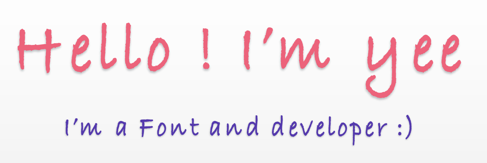

<!--
 * @Description:
 * @Author: yeeChen
 * @Date: 2023-06-02 12:08:42
 * @LastEditTime: 2023-06-05 15:04:40
 * @LastEditors: yeeChen
-->

<h2>  Welcome to yee's GitHub </h2>
<p align="center"></p>

###  A little more about me

```js
class AboutMe {
    constructor{
        this.name = name
        this.age = age
        this.language = language
        this.experience = experience
    }
    Hello(){
        return 'Hello World'
    }
}

let Yee = new AboutMe('yee',23,'javaScript','0')
```

###  im doing

<div align="center">
<!-- svg -->


<br>

<!-- gif -->


</div>

<!-- just img 图片 -->

### 🌠Coding Time

> the projects I'm working on

<!--  -->
<!--  -->

<div>
    
    
</div>

</div>
<!--
**yeeiChen/yeeiChen** is a ✨ _special_ ✨ repository because its `README.md` (this file) appears on your GitHub profile.

Here are some ideas to get you started:

- 🔭 I’m currently working on ...
- 🌱 I’m currently learning ...
- 👯 I’m looking to collaborate on ...
- 🤔 I’m looking for help with ...
- 💬 Ask me about ...
- 📫 How to reach me: ...
- 😄 Pronouns: ...
- ⚡ Fun fact: ...
  -->
